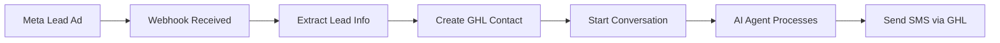

# GHL LangGraph Agent - Complete Documentation

## 🚀 Project Overview

This is an AI-powered customer service agent that integrates Meta (Facebook/Instagram) leads with GoHighLevel (GHL) using LangGraph. The agent automatically qualifies leads based on budget requirements and schedules appointments for qualified prospects.

## 📋 Table of Contents

1. [Architecture](#architecture)
2. [Features](#features)
3. [Installation](#installation)
4. [Configuration](#configuration)
5. [How It Works](#how-it-works)
6. [API Endpoints](#api-endpoints)
7. [Deployment](#deployment)
8. [Testing](#testing)
9. [Troubleshooting](#troubleshooting)

## 🏗️ Architecture

```
Meta Lead Ads → Webhook → LangGraph Agent → GHL API → Customer SMS
      ↓            ↓            ↓              ↓
   Lead Data    Process    AI Decision    Send Message
```

### Key Components

1. **FastAPI Server** (`src/main.py`)
   - Handles webhook endpoints
   - Routes messages to the agent
   - Validates incoming data

2. **LangGraph Agent** (`src/agent/graph.py`)
   - AI-powered conversation flow
   - Lead qualification logic
   - Tool orchestration

3. **GHL Tools** (`src/tools/ghl_tools.py`)
   - Send SMS messages
   - Book appointments
   - Update contact information
   - Check calendar availability

4. **Webhook Handlers** (`src/webhooks/handlers.py`)
   - Process Meta lead events
   - Handle GHL message webhooks
   - Signature verification

## ✨ Features

- **Automatic Lead Capture**: Processes leads from Meta ads instantly
- **Intelligent Qualification**: AI agent qualifies leads based on $5,000 minimum budget
- **Appointment Scheduling**: Books appointments directly in GHL calendar
- **Conversation Memory**: Fetches conversation history from GHL
- **Error Recovery**: Built-in retry logic and graceful error handling
- **Real-time Messaging**: Sends SMS responses via GHL API
- **LangGraph Cloud Ready**: Configured for cloud deployment

## 📦 Installation

### Prerequisites

- Python 3.11+
- GoHighLevel account with API access
- Meta Business account (for lead ads)
- OpenAI or Anthropic API key

### Local Setup

1. **Clone the repository**
```bash
git clone https://github.com/palinopr/ghl_langgraph_agent.git
cd ghl_langgraph_agent
```

2. **Create virtual environment**
```bash
python -m venv venv
source venv/bin/activate  # On Windows: venv\Scripts\activate
```

3. **Install dependencies**
```bash
pip install -r requirements.txt
```

4. **Configure environment**
```bash
cp .env.example .env
# Edit .env with your API keys
```

5. **Run the server**
```bash
python -m src.main
```

Server will start on `http://localhost:8000`

## ⚙️ Configuration

### Required Environment Variables

```env
# GoHighLevel Configuration
GHL_API_KEY=your_ghl_api_key
GHL_LOCATION_ID=your_location_id
GHL_CALENDAR_ID=your_calendar_id

# LLM Configuration (choose one)
OPENAI_API_KEY=your_openai_key
# OR
ANTHROPIC_API_KEY=your_anthropic_key

# Meta Configuration (for lead ads)
META_VERIFY_TOKEN=your_verify_token
META_APP_SECRET=your_app_secret

# Optional
LANGCHAIN_API_KEY=your_langsmith_key
LANGCHAIN_TRACING_V2=true
TIMEZONE=America/New_York
```

### Configuration Validation

The system validates required configuration on startup. If any required keys are missing, it will exit with an error message listing what's needed.

## 🔄 How It Works

### 1. Lead Generation Flow



### 2. Conversation Flow

The AI agent follows this conversation pattern:

1. **Greeting Stage**: Welcome the lead warmly
2. **Discovery Stage**: Ask about project needs
3. **Qualification Stage**: Check budget (minimum $5,000)
4. **Scheduling Stage**: Book appointment if qualified
5. **Completion Stage**: Confirm appointment or provide alternatives

### 3. Message Processing

When a message is received:

```python
# 1. Webhook receives message
POST /webhook/ghl
{
    "type": "InboundMessage",
    "contactId": "contact-123",
    "message": {"body": "I need a website"}
}

# 2. Agent processes message
result = await process_ghl_message(
    contact_id="contact-123",
    conversation_id="conv-456",
    message="I need a website"
)

# 3. Agent uses tools to respond
await send_ghl_message(
    contact_id="contact-123",
    message="Hello! I'd love to help..."
)
```

## 🌐 API Endpoints

### Health Check
```http
GET /
Response: {"status": "healthy", "service": "GHL LangGraph Agent"}
```

### Meta Webhook Verification
```http
GET /webhook/meta?hub.mode=subscribe&hub.verify_token=TOKEN&hub.challenge=CHALLENGE
```

### Meta Lead Webhook
```http
POST /webhook/meta
Body: Meta lead generation payload
```

### GHL Message Webhook
```http
POST /webhook/ghl
Body: {
    "type": "InboundMessage",
    "locationId": "location-id",
    "contactId": "contact-id",
    "conversationId": "conversation-id",
    "message": {
        "body": "Message text"
    }
}
```

### Test Conversation
```http
POST /test/conversation
Body: {
    "contact_id": "test-123",
    "message": "I need help with a website"
}
```

## 🚀 Deployment

### LangGraph Cloud Deployment

1. **Install CLI**
```bash
pip install -U langgraph-cli
```

2. **Authenticate**
```bash
langgraph auth
```

3. **Deploy from GitHub**
```bash
langgraph deploy --name "ghl-customer-agent" \
  --github-repo "palinopr/ghl_langgraph_agent" \
  --branch "main"
```

4. **Configure Environment Variables in LangSmith UI**

5. **Set up Webhooks with deployment URL**

### Docker Deployment

```bash
# Build and run with Docker Compose
docker-compose up -d

# Or build manually
docker build -t ghl-agent .
docker run -p 8000:8000 --env-file .env ghl-agent
```

## 🧪 Testing

### Test Local Conversation
```bash
# Test a simple conversation
curl -X POST http://localhost:8000/test/conversation \
  -H "Content-Type: application/json" \
  -d '{"contact_id": "test-123", "message": "I need a website"}'
```

### Test Webhook
```bash
# Test GHL webhook
curl -X POST http://localhost:8000/webhook/ghl \
  -H "Content-Type: application/json" \
  -d '{
    "type": "InboundMessage",
    "locationId": "your-location-id",
    "contactId": "test-contact",
    "message": {"body": "Hello"}
  }'
```

### Test Deployment
```python
# Use test_deployment.py
python test_deployment.py
```

## 🔧 Troubleshooting

### Common Issues

1. **"Configuration validation failed"**
   - Check all required environment variables are set
   - Verify API keys are valid

2. **"Failed to send message"**
   - Check GHL API key permissions
   - Verify contact_id exists in GHL
   - Check API rate limits

3. **Webhook not receiving data**
   - Verify webhook URL is publicly accessible
   - Check webhook signature verification
   - Review server logs for errors

4. **Agent not responding properly**
   - Check LLM API key is valid
   - Verify prompt in `src/agent/graph.py`
   - Enable debug logging

### Debug Mode

Enable detailed logging:
```python
# In src/main.py
structlog.configure(
    processors=[...],
    level="DEBUG"  # Change from INFO to DEBUG
)
```

### View Logs
```bash
# Local logs
tail -f server.log

# LangGraph Cloud logs
langgraph logs --name "ghl-customer-agent"
```

## 📁 Project Structure

```
ghl_langgraph_agent/
├── src/
│   ├── __init__.py
│   ├── main.py              # FastAPI server
│   ├── config.py            # Configuration management
│   ├── models.py            # Data models
│   ├── agent/
│   │   ├── __init__.py
│   │   └── graph.py         # LangGraph agent logic
│   ├── tools/
│   │   ├── __init__.py
│   │   └── ghl_tools.py     # GHL API tools
│   └── webhooks/
│       ├── __init__.py
│       └── handlers.py      # Webhook processors
├── langgraph.json           # LangGraph Cloud config
├── requirements.txt         # Python dependencies
├── Dockerfile              # Docker configuration
├── docker-compose.yml      # Docker Compose setup
├── .env.example           # Environment template
├── README.md              # Basic documentation
├── DEPLOYMENT.md          # Deployment guide
└── CLAUDE.md             # This file
```

## 🔐 Security Considerations

1. **API Keys**: Never commit `.env` files
2. **Webhook Verification**: Always verify Meta signatures
3. **Rate Limiting**: Implement rate limits for production
4. **Error Messages**: Don't expose sensitive data in errors
5. **HTTPS**: Always use HTTPS for webhooks

## 🛠️ Customization

### Modify Conversation Flow

Edit the system prompt in `src/agent/graph.py`:
```python
SYSTEM_PROMPT = """Your custom prompt here..."""
```

### Add New Tools

Create new tools in `src/tools/` and add to the agent:
```python
@tool
async def my_custom_tool(param: str) -> str:
    """Tool description"""
    # Implementation
    
# Add to tools list
tools = [...existing_tools, my_custom_tool]
```

### Change Qualification Criteria

Modify the prompt to change budget requirements or add new criteria.

## 📊 Monitoring

### LangSmith Tracing

View conversation traces at [smith.langchain.com](https://smith.langchain.com)

### Metrics to Track
- Message response time
- Qualification rate
- Appointment booking rate
- Error rate
- API usage

## 🤝 Contributing

1. Fork the repository
2. Create a feature branch
3. Make your changes
4. Add tests if applicable
5. Submit a pull request

## 📄 License

MIT License - See LICENSE file for details

## 🆘 Support

- **GitHub Issues**: [github.com/palinopr/ghl_langgraph_agent/issues](https://github.com/palinopr/ghl_langgraph_agent/issues)
- **LangChain Discord**: For LangGraph specific questions
- **GHL Documentation**: [highlevel.com/api-docs](https://highlevel.com/api-docs)

---

Built with ❤️ using LangGraph, FastAPI, and GoHighLevel